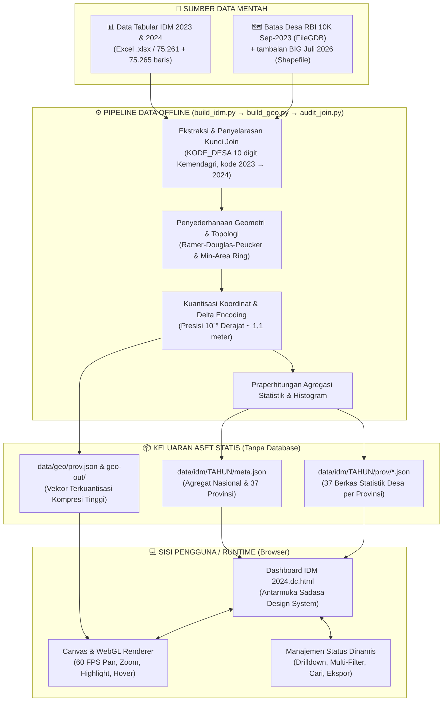

# 🇮🇩 Peta Desa Nusantara — Visualisasi & Dashboard GIS IDM 2023–2024

<div align="center">

**Platform Analisis dan Visualisasi Spasial-Statistik Indeks Desa Membangun (IDM) 2023 & 2024 Seluruh Indonesia**

[](LICENSE)
[](#-cakupan-dan-statistik-utama)
[](#-profil-dan-klasifikasi-idm-2024)
[](#%EF%B8%8F-pilihan-tahun-idm-2023--2024)
[](#-arsitektur--pipeline-data)
[](#-arsitektur--pipeline-data)
[](#)

[Fitur Utama](#-fitur-utama) • [Statistik IDM 2024](#-profil-dan-klasifikasi-idm-2024) • [Pilihan Tahun](#%EF%B8%8F-pilihan-tahun-idm-2023--2024) • [Arsitektur & Pipeline](#-arsitektur--pipeline-data) • [Struktur Direktori](#-struktur-direktori) • [Panduan Menjalankan](#-panduan-instalasi--menjalankan-proyek) • [Spesifikasi Geometri](#-spesifikasi-teknis-geometri)

</div>

---

## 📌 Ringkasan Proyek

**Peta Desa Nusantara** adalah dashboard analitik GIS (*Geographic Information System*) interaktif yang memetakan status perkembangan dan kemandirian **75.265 desa** di **434 kabupaten/kota**, **6.554 kecamatan**, dan **37 provinsi** di Indonesia. Data yang ditampilkan bersumber dari data resmi **Indeks Desa Membangun (IDM) 2024** terbitan Kementerian Desa, Pembangunan Daerah Tertinggal, dan Transmigrasi (Kemendes PDTT) yang diperoleh melalui [Portal Satu Data Indonesia (data.go.id)](https://data.go.id/dataset/dataset/data-indeks-desa-membangun-tahun-2024), ditambah **IDM 2023** sebagai pembanding. Keduanya diintegrasikan dengan batas wilayah Rupa Bumi Indonesia (RBI) dari Badan Informasi Geospasial (BIG); desa yang belum punya poligon di RBI 2023 diisi dari BATAS_DESAKEL_AR BIG edisi Juli 2026.

### Latar Belakang & Masalah
* **Data Spasial dan Statistik Masih Terpisah:** Data nilai IDM awalnya tersimpan dalam lembar kerja spreadsheet berukuran besar (*Excel 7,7 MB*), sedangkan poligon batas wilayah desa berada di berkas *Esri File Geodatabase / Shapefile (339 MB – 1+ GB)*. Untuk menggabungkan dan menganalisis keduanya, pengguna umumnya membutuhkan keahlian teknis khusus dan aplikasi GIS berat seperti ArcGIS atau QGIS.
* **Beban Render Peta yang Berat:** Menampilkan lebih dari 83.000 poligon batas wilayah di peramban secara langsung biasanya memakan memori ratusan megabita, sehingga rentan membuat browser lambat, membeku (*freeze*), atau bahkan tertutup sendiri (*crash*).
* **Akses Informasi yang Terbatas:** Pemangku kebijakan daerah (seperti Bappeda), analis kementerian, tenaga pendamping desa, akademisi, jurnalis, hingga warga desa kerap kesulitan melihat profil perkembangan desa mereka beserta rincian indikator pembentuknya (IKS, IKE, IKL) secara instan.

### Solusi & Inovasi yang Dihadirkan
* **Arsitektur Web Statis Ringan (*Zero-Server Static GIS*):** Mengubah seluruh data tabular dan spasial menjadi berkas JSON terkompresi dan terkuantisasi, yang dimuat secara bertahap per provinsi sesuai kebutuhan (*on-demand lazy loading*).
* **Dua Mode Visualisasi Dinamis:** Menyediakan **Mode Peta Choropleth (Geografis)** dan **Mode Petak (*Grid Cartogram / Equal Area*)**. Pada mode petak, setiap desa digambarkan sebagai satu kotak berukuran seragam. Hal ini mengeliminasi bias ukuran wilayah geografis, sehingga desa-desa kecil di wilayah perkotaan maupun kepulauan terluar tetap terlihat jelas dan berbobot sama dalam analisis statistik.
* **Pipeline Pemrosesan Spasial Murni Python:** Menggunakan skrip konversi geometri (`build_geo.py`) yang memanfaatkan pustaka standar bawaan Python murni (tanpa ketergantungan pada dependensi rumit seperti GDAL, GeoPandas, atau Shapely) untuk mengolah Shapefile ratusan megabita menjadi data vektor web yang sangat ramping.

---

## 🎯 Cakupan dan Statistik Utama

```
┌─────────────────────────────────────────────────────────────────────────────────┐
│                           CAKUPAN DATA NASIONAL IDM 2024                        │
├───────────────────┬───────────────────┬───────────────────┬─────────────────────┤
│   75.265 Desa     │   6.554 Kecamatan │  434 Kab / Kota   │    37 Provinsi      │
├───────────────────┴───────────────────┴───────────────────┴─────────────────────┤
│ Rata-rata Skor Nasional: 0,7120        │ Rentang Skor     : 0,2176 — 1,0000     │
│ Ketahanan Sosial (IKS) : 0,7662        │ Ketahanan Lingk. (IKL): 0,7502         │
│ Ketahanan Ekonomi (IKE): 0,6198        │ Poligon Master   : 83.486 Wilayah      │
└─────────────────────────────────────────────────────────────────────────────────┘
```

---

## 📊 Profil dan Klasifikasi IDM 2024

Indeks Desa Membangun (IDM) membagi status perkembangan desa ke dalam **5 tingkatan kemandirian** berdasarkan nilai komposit dari tiga pilar utama: **Indeks Ketahanan Sosial (IKS)**, **Indeks Ketahanan Ekonomi (IKE)**, dan **Indeks Ketahanan Lingkungan (IKL)**.

```
       IDM = (IKS + IKE + IKL) / 3
```

| Status Desa | Rentang Nilai IDM | Kode Warna | Jumlah Desa | Proporsi (%) | Karakteristik Utama |
| :--- | :---: | :---: | :---: | :---: | :--- |
| **MANDIRI** | $\text{IDM} > 0.8155$ | `#137a52` (Hijau Tua) | **17.203** | **22,9%** | Memiliki ketahanan sosial, ekonomi, dan ekologi yang kuat serta berkelanjutan |
| **MAJU** | $0.7073 \le \text{IDM} \le 0.8154$ | `#62a84f` (Hijau Terang) | **23.063** | **30,6%** | Memiliki potensi sumber daya memadai dengan akses pelayanan dasar yang baik |
| **BERKEMBANG** | $0.5990 \le \text{IDM} \le 0.7072$ | `#e0bd3d` (Kuning Emas) | **24.532** | **32,6%** | Memiliki potensi sumber daya yang belum optimal dikelola, akses layanan menengah |
| **TERTINGGAL** | $0.4908 \le \text{IDM} \le 0.5989$ | `#d4602b` (Oranye) | **6.100** | **8,1%** | Keterbatasan infrastruktur dasar, aksesibilitas, pelayanan publik, dan ekonomi |
| **SANGAT TERTINGGAL** | $\text{IDM} \le 0.4907$ | `#a51f2d` (Merah Tua) | **4.363** | **5,8%** | Mengalami kerentanan multidimensi, risiko bencana tinggi, isolasi geografis, dan kemiskinan |

---

## 🗓️ Pilihan Tahun IDM 2023 & 2024

Tombol **2023 | 2024** di pojok kanan atas peta mengganti seluruh tampilan tanpa me-reset zoom: warna peta, petak, KPI, peringkat, histogram, tabel, dan ekspor CSV/PNG (nama berkas `idm-<tahun>-…`). Kartu detail desa juga menampilkan perubahan **2023 → 2024**: nilai, status, selisih poin, dan label *Naik ke…/Turun ke…/Status tetap*.

| Status | IDM 2023 | % | IDM 2024 | % |
| :--- | ---: | ---: | ---: | ---: |
| Mandiri | 11.456 | 15,2% | 17.203 | 22,9% |
| Maju | 23.035 | 30,6% | 23.063 | 30,6% |
| Berkembang | 28.766 | 38,2% | 24.532 | 32,6% |
| Tertinggal | 7.154 | 9,5% | 6.100 | 8,1% |
| Sangat Tertinggal | 4.850 | 6,4% | 4.363 | 5,8% |
| **Jumlah desa** | **75.261** | | **75.265** | |
| Rerata IDM nasional | 0,6935 | | 0,7120 | |

**Satu geometri untuk dua tahun.** Kode desa IDM 2023 dan 2024 identik untuk 74.322 desa. Ada dua perbedaan:
- **Papua Barat Daya.** IDM 2023 masih mencatat 939 desanya di bawah Papua Barat (kab 92.01/92.04/92.05/92.09/92.10). `tools/idm_sources.py` menerjemahkan kode itu ke 96.01/96.04/96.05/96.09/96.10 (939 dari 939 cocok), sehingga di dashboard Papua Barat Daya tampil sebagai provinsi tersendiri pada kedua tahun.
- **4 desa baru di IDM 2024** (3 di Aceh, 1 di Kalimantan Selatan). Di tampilan 2023, poligonnya berwarna abu-abu dengan label *Belum ada di IDM 2023*, bukan dihitung sebagai gagal join.

Kolom `UPDATE` di IDM 2023 bernilai 2022 untuk 1.165 desa. Desa-desa ini diberi lencana **Data 2022** di kartu detail.

---

## ✨ Fitur Utama

```
┌──────────────────────────────────────────────────────────────────────────────────┐
│                             FITUR UTAMA DASHBOARD                                │
├─────────────────────────┬─────────────────────────┬──────────────────────────────┤
│ 🗺️ Dua Mode Visualisasi │ 🔍 Eksplorasi 4 Tingkat │ 📈 Panel Analitik Interaktif │
│ • Mode Peta Choropleth  │ • Nasional ➔ Provinsi   │ • Perbandingan Delta KPI     │
│ • Mode Petak Cartogram  │ • Kab/Kota ➔ Kecamatan  │ • Histogram Sebaran IDM      │
│ • Render Canvas / WebGL │ • Breadcrumb Interaktif │ • Papan Peringkat Wilayah    │
├─────────────────────────┼─────────────────────────┼──────────────────────────────┤
│ ⚡ Pencarian Cepat      │ 🏷️ Profil Detail Desa   │ 📥 Ekspor Data Lengkap       │
│ • Pencocokan Cerdas     │ • Rincian Sub-Indeks    │ • Unduh Tabel (.CSV)         │
│ • Auto-center & Zoom    │ • Asal Data (Provenance)│ • Tangkapan Peta Resolusi HD │
│ • Filter Kategori Status│ • Analisis Komparasi    │ • Tabel Data Cepat & Ringan  │
└─────────────────────────┴─────────────────────────┴──────────────────────────────┘
```

### 1. 🗺️ Dua Mode Visualisasi (Peta vs Petak)
* **Mode Peta Geografis (*GIS Choropleth*):** Menampilkan poligon batas administratif wilayah secara akurat dengan akselerasi GPU Canvas pada kecepatan rendering 60 FPS.
* **Mode Petak (*Equal-Area Grid Cartogram*):** Setiap desa disajikan dalam kotak modular berukuran sama dengan warna sesuai statusnya. Mode ini sangat efektif untuk menghilangkan bias ukuran geografis, memastikan desa-desa berwilayah sempit di kawasan perkotaan maupun pulau-pulau kecil tetap terlihat jelas dan berbobot setara saat dianalisis.

### 2. 🔍 Eksplorasi Wilayah Bertingkat (*4-Level Drill-Down*)
* Pengguna dapat menelusuri data secara terstruktur: **Nasional (37 Provinsi)** $\rightarrow$ **Provinsi** $\rightarrow$ **Kabupaten/Kota** $\rightarrow$ **Kecamatan** $\rightarrow$ **Detail Desa**.
* Dilengkapi **jalur navigasi interaktif (*breadcrumbs*)**, tombol kembali ke tingkat atas (*Go Up*), dan menu dropdown dinamis untuk berpindah wilayah secara cepat.

### 3. 📈 Panel Analitik Komprehensif
* **Kartu Indikator Kunci (KPI):** Menampilkan total desa, rata-rata skor IDM wilayah terpilih, selisih ($\pm \Delta$) terhadap rata-rata nasional, persentase desa Mandiri, serta konsentrasi desa Tertinggal/Sangat Tertinggal.
* **Bagan Distribusi & Legenda Interaktif:** Menampilkan proporsi 5 kategori status IDM. Klik pada salah satu label status untuk menyaring atau menyembunyikan kategori tersebut di peta dan tabel secara seketika (*interactive filter*).
* **Papan Peringkat Wilayah (*Leaderboard*):** Menampilkan 14 wilayah dengan nilai tertinggi atau terendah, yang dapat dialihkan urutannya (*tertinggi dulu / terendah dulu*) dengan satu klik.
* **Histogram Sebaran IDM (24 Interval):** Grafik distribusi nilai IDM lengkap dengan garis penunjuk rata-rata (*mean indicator*) dan *tooltip* interaktif per rentang nilai.
* **Komparasi Sub-Indeks (IKS, IKE, IKL):** Visualisasi selisih capaian ketiga pilar ketahanan wilayah terhadap standar rata-rata nasional.

### 4. 🏷️ Kartu Rincian & Profil Mendalam Tiap Desa
Memilih desa mana pun (melalui peta, petak cartogram, tabel data, atau hasil pencarian) akan menampilkan kartu profil lengkap:
* Skor komposit IDM (hingga 4 desimal) serta perbandingannya dengan rata-rata nasional.
* Rincian nilai ketiga pilar: **IKS (Ketahanan Sosial)**, **IKE (Ketahanan Ekonomi)**, dan **IKL (Ketahanan Lingkungan)**.
* **Lencana Status Data (*Data Provenance*):** Penanda informasi khusus desa, seperti status data *Pembaruan 2023*, *Server PDN*, atau *Reguler*.

### 5. ⚡ Pencarian Cepat & Cerdas (*Instant Search*)
* Pencarian data desa secara langsung dengan dukungan pencocokan fleksibel (*substring & fuzzy search*).
* Menampilkan daftar saran lengkap dengan indikator warna status, nama kecamatan, dan kabupaten asal.
* Mengklik hasil pencarian akan langsung mengarahkan tampilan kamera peta (*pan & zoom*) ke lokasi desa yang dipilih.

### 6. 📑 Tabel Data Interaktif & Ekspor
* **Tabel Terurut Dinamis:** Menampilkan seluruh baris desa atau provinsi dalam cakupan aktif, dengan dukungan pengurutan berdasarkan Nama, Nilai IDM, IKS, IKE, IKL, maupun Kategori Status.
* **Ekspor CSV:** Mengunduh seluruh data tabel yang sedang aktif ke format `.csv` dengan satu klik.
* **Ekspor Gambar Peta (PNG):** Menyimpan tampilan visual peta dalam resolusi tinggi langsung ke format berkas gambar `.png`.

---

## 🏗️ Arsitektur & Pipeline Data

Proyek ini dibangun dengan prinsip **"Heavy build-time, ultra-light runtime"**. Karena data IDM 2024 merupakan data tahunan yang bersifat statis, seluruh proses komputasi yang berat (penggabungan data tabular, reduksi presisi koordinat, kuantisasi, penyederhanaan topologi poligon, hingga pemisahan berkas per provinsi) diselesaikan di awal pada tahap pembangunan data (*build time*).



---

## 📐 Spesifikasi Teknis Geometri

Skrip `tools/build_geo.py` dirancang khusus untuk membaca berkas biner *Shapefile* (`.shp`, `.dbf`, `.shx`) secara langsung menggunakan modul bawaan Python (`struct`, `json`, `math`), tanpa memerlukan dependensi GIS pihak ketiga:

### 1. Kuantisasi & Delta Encoding Koordinat
Koordinat derajat desimal (WGS 84 / EPSG:4326) dikonversi menjadi bilangan bulat diskret (*integer*) dengan faktor kuantisasi $Q = 100.000$:

$$X_q = \lfloor (Lon - Lon_{min}) \times 100.000 \rceil$$

$$Y_q = \lfloor (Lat - Lat_{min}) \times 100.000 \rceil$$

Titik-titik berurutan kemudian dihitung selisih nilainya (*Delta Encoding*):

$$\Delta X_i = X_{q, i} - X_{q, i-1}, \quad \Delta Y_i = Y_{q, i} - Y_{q, i-1}$$

Pendekatan ini menghasilkan deret bilangan bulat kecil yang sangat efisien saat dikompresi ke format JSON/Gzip, sehingga mampu memangkas ukuran payload hingga **lebih dari 85%** tanpa mengorbankan ketajaman visual peta.

### 2. Penyesuaian Pemekaran Wilayah di Papua
Pipeline ini menyertakan pemetaan relasi kode wilayah secara otomatis untuk mengakomodasi pemekaran **4 Daerah Otonom Baru (DOB) di Tanah Papua**, dengan menghubungkan 4 digit kode kabupaten BPS ke 2 digit kode provinsi terbaru:
* **Papua (91)**, **Papua Barat (92)**, **Papua Selatan (93)**, **Papua Tengah (94)**, **Papua Pegunungan (95)**, dan **Papua Barat Daya (96)**.

---

## 📁 Struktur Direktori

```
Visualisasi Indeks Desa Membangun 2024/
│
├── Dashboard IDM 2024.dc.html            # Aplikasi web dashboard utama (Single-Page Application)
├── PRD-Dashboard-GIS-IDM-2024.html       # Dokumen Spesifikasi Produk (PRD) interaktif
├── support.js                            # Runtime pendukung & pengurai komponen reaktif
│
├── data/                                 # Sumber data dan hasil komputasi terstruktur
│   ├── indeks-desa-membangun-tahun-2024-hasil-pemutakhiran.xlsx  # IDM 2024 Kemendes PDTT
│   ├── indeks-desa-membangun-idm-tahun-2023.xlsx                 # IDM 2023 Kemendes PDTT
│   ├── rekap-indeks-desa-membangun-tahun-2024.xlsx               # Rekap tingkat provinsi
│   ├── geo/                              # Geometri bersama untuk semua tahun
│   │   ├── manifest.json                 # Manifest ketersediaan layer data spasial
│   │   ├── prov.json                     # Geometri poligon 38 provinsi terkuantisasi
│   │   ├── desa/ kec/ kab/               # Geometri per provinsi (fitur tambalan bertanda "s":1)
│   │   └── patch-report.json             # Desa yang poligonnya ditambal dari BIG Juli 2026
│   └── idm/
│       ├── 2023/                         # Struktur sama dengan 2024; kode sudah diterjemahkan
│       └── 2024/
│           ├── meta.json                 # Agregat nasional, provinsi, kab/kota & histogram
│           ├── join-audit.json           # Audit Excel → JSON → geometri untuk tahun ini
│           └── prov/                     # 37 berkas JSON data desa per provinsi
│               ├── 11.json (Aceh)
│               ├── ...
│               └── 96.json (Papua Barat Daya)
│
├── tools/                                # Utilitas pengolahan data & konversi geometri
│   ├── idm_sources.py                    # Kolom Excel per tahun + terjemahan kode 2023 → 2024
│   ├── build_idm.py                      # Excel IDM → data/idm/TAHUN/ (meta + prov)
│   ├── build_geo.py                      # FileGDB/SHP → vektor web, + tambalan poligon
│   ├── audit_join.py                     # Validasi Excel ↔ JSON ↔ geometri per tahun
│   └── build_geo.bat                     # Jalankan seluruh pipeline di Windows
│
├── _ds/                                  # Sistem Desain Sadasa Academy
│   └── sadasa-academy-design-system-.../ # Token CSS (Warna, Tipografi, Spasi, Animasi)
│
├── assets/                               # Media visual, ikon, dan logo
│   └── sadasa-mark-red.png
│
├── SHP GIS/                              # Dataset spasial master & referensi teknis GIS
│   ├── REFERENSI-DATASET-GIS-...md       # Laporan analisis komparasi 5 dataset batas Indonesia
│   ├── batas-administrasi-indonesia/     # Layer Shapefile batas administrasi
│   ├── RBI10K_ADMINISTRASI_DESA_...gdb   # Geodatabase batas desa skala 1:10.000 BIG
│   ├── RBI50K_ADMINISTRASI_KABKOTA_..gdb # Geodatabase batas kab/kota skala 1:50.000 BIG
│   └── [LapakGIS.com]_BATAS_DESAKEL_AR_EDISI_JULI_2026_/  # BIG Juli 2026, sumber tambalan
│
└── work/                                 # Area kerja data perantara (scratchpad TSV/JSON)
```

---

## 🚀 Panduan Instalasi & Menjalankan Proyek

Aplikasi ini dirancang sebagai **Aplikasi Web Statis Tanpa Server (*Zero-Server Static App*)**. Anda tidak perlu memasang database (seperti MySQL atau PostgreSQL) ataupun mengonfigurasi backend server yang rumit.

### Opsi A: Menjalankan Langsung di Komputer Lokal (Paling Cepat)
1. **Klon repositori ini:**
   ```bash
   git clone https://github.com/username/visualisasi-idm-2024.git
   cd visualisasi-idm-2024
   ```
2. **Jalankan server web lokal** (langkah ini diperlukan agar peramban dapat membaca data JSON lokal dengan *fetch API*):
   * Menggunakan **Python** (umumnya sudah tersedia di komputer):
     ```bash
     python -m http.server 8000
     ```
   * Atau menggunakan **Node.js**:
     ```bash
     npx serve .
     ```
   * Atau menggunakan ekstensi **VS Code Live Server**: Klik kanan pada berkas `Dashboard IDM 2024.dc.html` $\rightarrow$ pilih *Open with Live Server*.
3. Buka browser dan kunjungi alamat:
   ```
   http://localhost:8000/Dashboard%20IDM%202024.dc.html
   ```

---

### Opsi B: Membangun Ulang Data IDM & Geometri (Opsional)
Jalankan ini jika berkas Excel IDM atau data spasial berubah, atau jika Anda ingin mengubah tingkat penyederhanaan poligon:
1. Siapkan `.venv` dengan `pyogrio`, `shapely`, dan `openpyxl`. Cara paling cepat adalah klik dua kali `tools\build_geo.bat`: skrip ini membuat `.venv` bila belum ada, lalu menjalankan seluruh pipeline.
2. Salin sumber geometri ke `SHP GIS\`. Yang dibutuhkan adalah `RBI10K_ADMINISTRASI_DESA_20230928.gdb` (basis) dan folder `[LapakGIS.com]_BATAS_DESAKEL_AR_EDISI_JULI_2026_` (sumber tambalan).
3. Jalankan secara berurutan, karena `build_geo.py` membaca daftar kode desa dari `data/idm/`:
   ```bash
   .venv\Scripts\python tools\build_idm.py                  # Excel 2023 & 2024 -> data/idm/<tahun>/
   .venv\Scripts\python tools\build_geo.py                  # geometri + tambalan -> data/geo/
   .venv\Scripts\python tools\audit_join.py --year 2023 --strict
   .venv\Scripts\python tools\audit_join.py --year 2024 --strict
   ```
4. Opsi parameter yang tersedia:
   ```bash
   # Hanya memproses provinsi tertentu (misalnya: DIY & Jawa Tengah)
   .venv\Scripts\python tools\build_geo.py --prov 34 33

   # Menyesuaikan toleransi penyederhanaan (default: 0.00035)
   .venv\Scripts\python tools\build_geo.py --tol 0.0005 --target-kb 1500

   # Tanpa tambalan poligon (RBI Sep-2023 saja)
   .venv\Scripts\python tools\build_geo.py --no-patch
   ```

`build_idm.py` direproduksi byte-per-byte terhadap JSON IDM 2024 lama. Nilai desa dibulatkan 4 desimal, lalu rerata dihitung berurutan menurut kecamatan dan nama desa, dan dibulatkan setengah-ke-atas.

---

### Opsi C: Mengaudit Relasi Data Excel–GeoJSON
Jalankan audit ini setelah memperbarui berkas Excel IDM atau membangun ulang geometri untuk memastikan konsistensi dan integritas data:

```bash
.venv\Scripts\python tools\audit_join.py --year 2024 --strict
.venv\Scripts\python tools\audit_join.py --year 2023 --strict
```

Skrip audit mencocokkan kode wilayah 10 digit yang dipakai dashboard (untuk 2023, sesudah diterjemahkan ke penomoran 2024), memeriksa duplikasi, dan memastikan data Excel dan JSON selaras. Rincian per provinsi dan daftar desa tanpa poligon disimpan ke `data/idm/<tahun>/join-audit.json`. Dashboard membaca berkas ini untuk catatan desa tanpa skor, beda nama, dan desa yang hanya ada di tahun lain. Wilayah berkode `1xxx` otomatis diklasifikasikan sebagai kelurahan, yang berada di luar cakupan IDM.

**Catatan status data saat ini:**

| | IDM 2024 | IDM 2023 |
| :--- | ---: | ---: |
| Baris desa (Excel = JSON) | **75.265** | **75.261** (939 kode Papua Barat Daya diterjemahkan) |
| Fitur geometri | 83.685 (288 tambalan BIG Juli 2026) | sama |
| Terhubung presisi (*exact match*) | **75.218** (99,94%) | **75.214** (99,94%) |
| Desa tanpa poligon | **47** | **47** |
| Kelurahan di luar cakupan IDM | 8.467 | 8.467 |
| Poligon desa yang hanya ada di tahun lain | 0 | 4 (desa baru 2024) |
| Desa tanpa catatan skor | 4 | 0 |
| Beda penulisan nama pada kode yang sama | 4 | 4 |
| Poligon desa valid yang gagal terhubung | **0** | **0** |

Sebelum tambalan, RBI September 2023 saja menyisakan 335 desa tanpa poligon. Tambalan mengisi 288 desa dan tercatat di `data/geo/patch-report.json`. Satu tambalan (Situak Ujung Gading, Kab. Pasaman Barat) sengaja dibatalkan karena akan menghapus poligon desa induknya, Ujung Gading. Sisa 46 desa lainnya tidak ada di sumber mana pun, sebagian besar di Papua Tengah dan Papua Pegunungan.

---

## 🎨 Sistem Desain & Aksesibilitas

Dashboard ini mengimplementasikan prinsip desain editorial modern berbasis **Sadasa Academy Design System**:
* **Palet Warna Terukur:** Menggunakan kombinasi warna dengan rasio kontras data (*data-ink ratio*) yang optimal dan variasi saturasi yang pas, sehingga perbedaan antar status IDM terlihat tegas dan informatif.
* **Aksesibilitas & Keterbacaan:** Setiap indikator warna selalu dilengkapi teks label yang jelas pada tooltip, tabel, dan legenda. Pendekatan ini memastikan informasi tetap dapat dipahami dengan baik oleh pengguna dengan keterbatasan persepsi warna (*color blindness*).
* **Tipografi Presisi:** Memadukan font sans-serif modern yang nyaman dibaca untuk elemen antarmuka teks, serta font monospace dengan dukungan `tabular-nums` agar deret angka metrik tersusun sejajar dan rapi.
* **Tata Letak Responsif:** Tampilan antarmuka fleksibel dan otomatis menyesuaikan ukuran layar, mulai dari monitor desktop lebar hingga perangkat tablet dan layar sentuh.

---

## 📚 Sumber Data & Atribusi

* **Data Statistik IDM 2024:** Kementerian Desa, Pembangunan Daerah Tertinggal, dan Transmigrasi Republik Indonesia ([Kemendes PDTT](https://kemendesa.go.id)) melalui [Portal Satu Data Indonesia: Data Indeks Desa Membangun Tahun 2024](https://data.go.id/dataset/dataset/data-indeks-desa-membangun-tahun-2024).
* **Data Statistik IDM 2023:** Kemendes PDTT, berkas `indeks-desa-membangun-idm-tahun-2023.xlsx` (75.261 desa).
* **Data Spasial Batas Administrasi:** Badan Informasi Geospasial ([BIG - Geoportal RBI](https://tanahair.indonesia.go.id)) & Direktorat Jenderal Bina Administrasi Kewilayahan Kementerian Dalam Negeri ([Kemendagri](https://kemendagri.go.id)). Basis: RBI 10K Administrasi Desa (28-09-2023). Tambalan: layanan BIG `BATASWILAYAH/BATAS_DESAKEL_AR` edisi Juli 2026 (unduhan LapakGIS.com); lihat `SHP GIS/REFERENSI-DATASET-GIS-BATAS-ADMINISTRASI.md` §7a.
* **Sistem Desain & Aset Visual:** [Sadasa Academy](https://sadasa.id).

---

## 📄 Lisensi

Proyek ini dirilis di bawah lisensi **MIT License**. Anda bebas menggunakan, memodifikasi, dan menyebarluaskan kode ini untuk keperluan riset, akademik, jurnalisme data, maupun implementasi praktis lainnya dengan tetap menyertakan atribusi ke pengembang asli.

---

<div align="center">

**Dikembangkan dengan ❤️ untuk Kemajuan Desa dan Keterbukaan Data Indonesia.**

⭐ *Jika repositori ini bermanfaat untuk pekerjaan atau riset Anda, jangan ragu untuk memberikan bintang (Star) pada repositori ini!*

</div>
