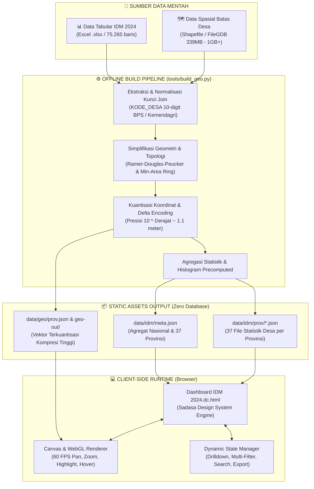

# 🇮🇩 Peta Desa Nusantara — Visualisasi & Dashboard GIS IDM 2024

<div align="center">


**Platform Analisis dan Visualisasi Spasial-Statistik Indeks Desa Membangun (IDM) 2024 Seluruh Indonesia**

[](LICENSE)
[](#cakupan-dan-statistik-utama)
[](#profil-dan-klasifikasi-idm-2024)
[](#pipeline-data-spasial--tabular)
[](#arsitektur--teknologi)
[](#)

[Fitur Utama](#-fitur-utama) • [Statistik IDM 2024](#-profil-dan-klasifikasi-idm-2024) • [Arsitektur & Pipeline](#-arsitektur--pipeline-data) • [Struktur Proyek](#-struktur-direktori) • [Panduan Menjalankan](#-panduan-instalasi--menjalankan-proyek) • [Spesifikasi Teknis](#-spesifikasi-teknis-geometri)

</div>

---

## 📌 Ringkasan Eksekutif

**Peta Desa Nusantara** adalah dashboard analitik GIS (*Geographic Information System*) modern dan interaktif yang memetakan status kemandirian dan pembangunan **75.265 desa** di **434 kabupaten/kota**, **6.554 kecamatan**, dan **37 provinsi** di Indonesia berdasarkan data resmi **Indeks Desa Membangun (IDM) Tahun 2024** dari Kementerian Desa, Pembangunan Daerah Tertinggal, dan Transmigrasi (Kemendes PDTT) yang diintegrasikan dengan batas wilayah Rupa Bumi Indonesia (RBI) Badan Informasi Geospasial (BIG).

### Masalah yang Diselesaikan
* **Pemisahan Data Spasial & Statistik:** Data nilai IDM sebelumnya tersimpan di dalam berkas spreadsheet raksasa (*Excel 7.7 MB*), sedangkan poligon batas desa tersimpan di dalam *Esri File Geodatabase / Shapefile (339 MB - 1+ GB)*. Menggabungkan dan menganalisisnya membutuhkan perangkat lunak GIS khusus (ArcGIS/QGIS) serta kemampuan teknis yang rumit.
* **Performa Pemuatan Peta Raksasa:** Menampilkan lebih dari 83.000 poligon batas desa di seluruh Indonesia secara bersamaan akan menghasilkan beban komputasi ratusan megabita yang menyebabkan *browser crash* dan memori *freeze*.
* **Ketiadaan Alat Analisis yang Demokratis:** Pembuat kebijakan daerah (Bappeda), analis kementerian, pendamping desa, akademisi, jurnalis, maupun warga desa kesulitan mencari status spesifik desa mereka beserta faktor pemicu skornya (IKS, IKE, IKL) secara instan.

### Solusi & Inovasi Proyek
* **Zero-Server Static GIS Architecture:** Mengubah seluruh data tabular dan spasial menjadi payload JSON terkuantisasi yang sangat terkompresi, dimuat secara modular per provinsi saat dibutuhkan (*on-demand lazy loading*).
* **Dual Visualization Engine:** Menghadirkan **Mode Peta Choropleth (Geografis)** dan **Mode Petak (*Grid Cartogram / Equal Area*)** di mana setiap kotak merepresentasikan 1 desa untuk mengeliminasi bias area geografis pada desa-desa kecil dan wilayah kepulauan.
* **Pure Python Spatial Pipeline:** Mengembangkan modul konverter geometri (`build_geo.py`) berbasis *Python Standard Library murni* (tanpa dependensi GDAL, GeoPandas, atau Shapely) untuk memproses ratusan megabita Shapefile menjadi vektor web yang ultra-ringan.

---

## 🎯 Cakupan dan Statistik Utama

```
┌─────────────────────────────────────────────────────────────────────────────────┐
│                           CAKUPAN DATA NASIONAL IDM 2024                        │
├───────────────────┬───────────────────┬───────────────────┬─────────────────────┤
│   75.265 Desa     │   6.554 Kecamatan │  434 Kab / Kota   │    37 Provinsi      │
├───────────────────┴───────────────────┴───────────────────┴─────────────────────┤
│ Rerata Skor Nasional : 0,7120          │ Rentang Skor     : 0,2176 — 1,0000     │
│ Ketahanan Sosial (IKS): 0,7662         │ Ketahanan Lingk. (IKL): 0,7502         │
│ Ketahanan Ekonomi(IKE): 0,6198         │ Poligon Master   : 83.486 Wilayah      │
└─────────────────────────────────────────────────────────────────────────────────┘
```

---

## 📊 Profil dan Klasifikasi IDM 2024

Indeks Desa Membangun (IDM) mengklasifikasikan desa ke dalam **5 tingkat status kemandirian** berdasarkan ambang batas komposit dari tiga pilar sub-indeks: **Indeks Ketahanan Sosial (IKS)**, **Indeks Ketahanan Ekonomi (IKE)**, dan **Indeks Ketahanan Lingkungan (IKL)**.

```
       IDM = (IKS + IKE + IKL) / 3
```

| Status Desa | Ambang Nilai IDM | Kode Warna | Jumlah Desa | Proporsi (%) | Karakteristik Utama |
| :--- | :---: | :---: | :---: | :---: | :--- |
| **MANDIRI** | $\text{IDM} > 0.8155$ | `#137a52` (Hijau Tua) | **17.203** | **22,9%** | Memiliki kemampuan ketahanan sosial, ekonomi, dan ekologi berkelanjutan |
| **MAJU** | $0.7073 \le \text{IDM} \le 0.8154$ | `#62a84f` (Hijau Terang) | **23.063** | **30,6%** | Memiliki potensi sumber daya memadai dengan akses pelayanan dasar baik |
| **BERKEMBANG** | $0.5990 \le \text{IDM} \le 0.7072$ | `#e0bd3d` (Kuning Emas) | **24.532** | **32,6%** | Memiliki potensi sumber daya belum terkelola optimal, akses layanan menengah |
| **TERTINGGAL** | $0.4908 \le \text{IDM} \le 0.5989$ | `#d4602b` (Oranye) | **6.100** | **8,1%** | Keterbatasan infrastruktur, aksesibilitas, pelayanan publik, dan ekonomi rendah |
| **SANGAT TERTINGGAL** | $\text{IDM} \le 0.4907$ | `#a51f2d` (Merah Tua) | **4.363** | **5,8%** | Rentan kerentanan multidimensi, bencana, isolasi geografis, dan kemiskinan |

---

## ✨ Fitur Utama

```
┌──────────────────────────────────────────────────────────────────────────────────┐
│                             FITUR UTAMA DASHBOARD                                │
├─────────────────────────┬─────────────────────────┬──────────────────────────────┤
│ 🗺️ Dual Engine Visual   │ 🔍 4-Level Drill Down   │ 📈 Real-time Analytics       │
│ • Mode Peta Choropleth  │ • Nasional ➔ Provinsi   │ • KPI Delta vs Nasional      │
│ • Mode Petak Cartogram  │ • Kab/Kota ➔ Kecamatan  │ • Histogram 24 Selang        │
│ • WebGL / Canvas Render │ • Breadcrumb Interaktif │ • Leaderboard Peringkat      │
├─────────────────────────┼─────────────────────────┼──────────────────────────────┤
│ ⚡ Instant Search Engine │ 🏷️ Deep Dive Profil Desa│ 📥 Ekspor Data Lengkap       │
│ • Fuzzy Name Matcher    │ • Radar Sub-Indeks IKS  │ • Download Tabel .CSV        │
│ • Auto-center & Zoom    │ • Provenans Data        │ • Snapshot Peta .PNG Resolusi│
│ • Filter Status Chip    │ • Analisis Komparasi    │ • Virtualized DOM Table      │
└─────────────────────────┴─────────────────────────┴──────────────────────────────┘
```

### 1. 🗺️ Dual Rendering Engine (Peta vs Petak)
* **Mode Peta Geografis (*GIS Choropleth*):** Merender poligon batas administratif asli dengan rendering GPU Canvas berkecepatan 60 FPS.
* **Mode Petak (*Equal-Area Grid Cartogram*):** Setiap desa digambarkan sebagai satu kotak modular dengan warna sesuai statusnya. Mode ini sangat efektif untuk mengeliminasi bias ukuran pulau/geografis, sehingga desa-desa kecil di perkotaan atau pulau-pulau terluar tetap terlihat jelas dan berbobot sama dalam pembacaan statistik.

### 2. 🔍 Navigasi Hierarki 4-Tingkat (*Drill-Down*)
* Pengguna dapat menelusuri data secara terstruktur dari level **Nasional (37 Provinsi)** $\rightarrow$ **Provinsi** $\rightarrow$ **Kabupaten/Kota** $\rightarrow$ **Kecamatan** $\rightarrow$ **Desa Spesifik**.
* Navigasi dilengkapi **Breadcrumbs interaktif**, kontrol tombol level atas (*Go Up*), dan pemilihan dropdown dinamis.

### 3. 📈 Panel Analitik Komprehensif (*Right Rail Analytics*)
* **KPI Metrics Cards:** Menampilkan jumlah total desa, rata-rata skor IDM lingkup terpilih beserta selisih ($\pm \Delta$) terhadap rata-rata nasional, proporsi desa Mandiri, dan konsentrasi desa Tertinggal/Sangat Tertinggal.
* **Distribution Bar & Interactive Legend:** Bar proporsi 5 kelas status. Mengklik salah satu label status akan memfilter/menyembunyikan kelas tersebut dari peta dan tabel secara instan (*interactive filtering*).
* **Dynamic Ranking Leaderboard:** Menampilkan 14 wilayah peringkat teratas atau terbawah dengan tombol toggle urutan (*Highest first / Lowest first*).
* **24-Bin IDM Histogram:** Grafik sebaran frekuensi nilai IDM dengan penanda rerata (*mean indicator*) dan *hover tooltip* per rentang interval.
* **Sub-Index Comparison (IKS, IKE, IKL):** Visualisasi selisih nilai ketiga pilar ketahanan terhadap baseline nasional.

### 4. 🏷️ Desa Deep-Dive Inspector
Memilih desa apa pun (lewat klik peta, petak, tabel, atau pencarian) akan membuka kartu inspeksi mendalam:
* Skor komposit IDM 4 desimal beserta selisih terhadap rata-rata nasional.
* Skor detail **IKS (Ketahanan Sosial)**, **IKE (Ketahanan Ekonomi)**, dan **IKL (Ketahanan Lingkungan)**.
* **Badge Provenans Data:** Penanda khusus untuk desa yang memiliki status khusus (*Update 2023*, *Server PDN*, atau *Reguler*).

### 5. ⚡ Mesin Pencarian Cepat (*Instant Search*)
* Pencarian desa secara *real-time* dengan *sub-string & fuzzy matching*.
* Menampilkan daftar saran lengkap dengan kode status warna, kecamatan, dan kabupaten asal.
* Mengklik hasil pencarian langsung mengarahkan tampilan (*pan & zoom*) ke lokasi desa tersebut.

### 6. 📑 Virtualized Data Table & Exporting
* **Tabel Terurut Dinamis:** Menampilkan seluruh baris desa atau provinsi dalam lingkup aktif dengan kemampuan pengurutan berdasarkan Nama, Nilai IDM, IKS, IKE, IKL, atau Status.
* **Ekspor CSV:** Mengunduh dataset lingkup wilayah yang sedang aktif ke format `.csv` dengan satu klik.
* **Ekspor PNG:** Mengambil cuplikan visual peta beresolusi tinggi langsung ke format `.png`.

---

## 🏗️ Arsitektur & Pipeline Data

Proyek ini dirancang dengan filosofi **"Heavy build-time, ultra-light runtime"**. Karena data IDM 2024 merupakan data tahunan yang statis, seluruh pemrosesan komputasi berat (join data tabular, reduksi presisi, kuantisasi koordinat, generalisasi geometri, pemecahan per provinsi) diselesaikan di tahap *build time*.



---

## 📐 Spesifikasi Teknis Geometri

Modul `tools/build_geo.py` dirancang secara khusus untuk membaca *Shapefile* biner (`.shp`, `.dbf`, `.shx`) secara *low-level* menggunakan modul bawaan Python (`struct`, `json`, `math`):

### 1. Kuantisasi & Delta Encoding Koordinat
Koordinat derajat desimal (WGS 84 / EPSG:4326) dikonversi menjadi integer diskret dengan faktor kuantisasi $Q = 100.000$:

$$X_q = \lfloor (Lon - Lon_{min}) \times 100.000 \rceil$$

$$Y_q = \lfloor (Lat - Lat_{min}) \times 100.000 \rceil$$

Titik-titik berurutan kemudian dikonversi menjadi selisih diferensial (*Delta Encoding*):

$$\Delta X_i = X_{q, i} - X_{q, i-1}, \quad \Delta Y_i = Y_{q, i} - Y_{q, i-1}$$

Teknik ini menghasilkan array integer kecil yang sangat optimal saat dikompresi dalam format JSON/Gzip (mengurangi ukuran payload hingga **>85%** tanpa kehilangan detail visual).

### 2. Resolusi Pemekaran Wilayah Papua
Pipeline mencakup sistem pemetaan relasi 4 digit kode kabupaten BPS ke 2 digit kode provinsi terbaru untuk menangani pemekaran **4 Daerah Otonom Baru (DOB) di Papua**:
* **Papua (91)**, **Papua Barat (92)**, **Papua Selatan (93)**, **Papua Tengah (94)**, **Papua Pegunungan (95)**, **Papua Barat Daya (96)**.

---

## 📁 Struktur Direktori

```
Visualisasi Indeks Desa Membangun 2024/
│
├── Dashboard IDM 2024.dc.html            # Aplikasi web dashboard utama (Single-Page App)
├── PRD-Dashboard-GIS-IDM-2024.html       # Dokumen Spesifikasi Produk (PRD) lengkap & interaktif
├── support.js                            # Runtime environment & reactive component parser
│
├── data/                                 # Data terstruktur hasil komputasi & sumber
│   ├── indeks-desa-membangun-2024.xlsx   # Berkas data mentah resmi IDM 2024 Kemendes PDTT
│   ├── rekap-indeks-desa-membangun.xlsx  # Berkas rekapitulasi agregat provinsi
│   ├── geo/
│   │   ├── manifest.json                 # Manifest ketersediaan layer spasial
│   │   └── prov.json                     # Geometri poligon 37 provinsi terkuantisasi
│   └── idm/
│       ├── meta.json                     # Metadata agregat nasional, provinsi, & histogram
│       └── prov/                         # 37 berkas JSON berisi seluruh desa per provinsi
│           ├── 11.json (Aceh)
│           ├── 12.json (Sumatera Utara)
│           ├── ...
│           └── 96.json (Papua Barat Daya)
│
├── tools/                                # Utilitas pemrosesan data & geometri
│   ├── build_geo.py                      # Pure-Python Shapefile to Web Vector converter
│   └── build_geo.bat                     # Script eksekusi batch Windows
│
├── _ds/                                  # Sadasa Academy Design System
│   └── sadasa-academy-design-system-.../ # Tokens CSS (Color, Typography, Spacing, Motion)
│
├── assets/                               # Media visual, ikon, & logo brand
│   └── sadasa-mark-red.png
│
├── SHP GIS/                              # Dataset spasial master & dokumentasi referensi GIS
│   ├── REFERENSI-DATASET-GIS-...md       # Analisis teknis komparasi 5 dataset batas Indonesia
│   ├── batas-administrasi-indonesia/     # Layer Shapefile batas administrasi
│   ├── RBI10K_ADMINISTRASI_DESA_...gdb   # Geodatabase batas desa 1:10.000 BIG
│   └── RBI50K_ADMINISTRASI_KABKOTA_..gdb # Geodatabase batas kab/kota 1:50.000 BIG
│
└── work/                                 # Scratchpad ekstraksi data intermediate (TSV/JSON)
```

---

## 🚀 Panduan Instalasi & Menjalankan Proyek

Proyek ini dibangun sebagai **Zero-Server Static Web Application**. Tidak diperlukan instalasi database (MySQL, PostgreSQL, MongoDB), dan tidak diperlukan backend server rumit.

### Opsi A: Menjalankan Langsung di Browser (Paling Cepat)
1. **Clone repository ini:**
   ```bash
   git clone https://github.com/username/visualisasi-idm-2024.git
   cd visualisasi-idm-2024
   ```
2. **Jalankan local web server** (diperlukan agar browser mengizinkan *fetch* data JSON lokal):
   * Menggunakan **Python** (sudah terpasang di sebagian besar OS):
     ```bash
     python -m http.server 8000
     ```
   * Atau menggunakan **Node.js (`npx serve` / `live-server`):**
     ```bash
     npx serve .
     ```
   * Atau menggunakan ekstensi **VS Code Live Server**: Klik kanan pada `Dashboard IDM 2024.dc.html` $\rightarrow$ *Open with Live Server*.
3. Buka browser dan akses alamat:
   ```
   http://localhost:8000/Dashboard%20IDM%202024.dc.html
   ```

---

### Opsi B: Membangun Ulang Data Geometri Spasial (Opsional)
Jika Anda ingin memproses ulang layer Shapefile baru atau menyesuaikan tingkat simplifikasi poligon:
1. Pastikan Anda memiliki Python 3.8+ terpasang (tanpa perlu menginstal package pip tambahan).
2. Jalankan perintah:
   ```bash
   python tools/build_geo.py
   ```
3. Opsi argumen yang tersedia:
   ```bash
   # Hanya memproses provinsi tertentu (misal: DIY & Jawa Tengah)
   python tools/build_geo.py --prov 34 33

   # Menyesuaikan toleransi simplifikasi (default: 0.00035)
   python tools/build_geo.py --tol 0.0005 --target-kb 1500
   ```

---

## 🎨 Desain Sistem & Aksesibilitas

Dashboard ini mengimplementasikan prinsip desain editorial modern dengan **Sadasa Academy Design System**:
* **Harmonious Palette:** Menggunakan palet ramah data visualisasi (*data-ink ratio*) tinggi dengan variasi saturasi terkalibrasi untuk membedakan kategori status IDM secara tajam.
* **Dual Contrast & Accessible Text:** Nilai status selalu disertai teks eksplisit (*label redundancy*) pada tooltip, tabel, dan legenda untuk memastikan aksesibilitas penuh bagi pengguna disabilitas warna (*color blindness*).
* **Typography:** Menggunakan kombinasi font sans-serif modern berbobot presisi untuk antarmuka (*UI labels*) dan monospace font dengan fitur `tabular-nums` untuk perataan angka metrik yang sempurna.
* **Responsive Layout:** Grid responsif adaptif yang mendukung tampilan layar desktop monitor besar hingga perangkat layar sentuh (*touch screen & mobile devices*).

---

## 📚 Sumber Data & Atribusi

* **Data Statistik IDM 2024:** Kementerian Desa, Pembangunan Daerah Tertinggal, dan Transmigrasi Republik Indonesia ([Kemendes PDTT](https://kemendesa.go.id)).
* **Data Spasial Batas Administrasi:** Badan Informasi Geospasial ([BIG - Geoportal RBI](https://tanahair.indonesia.go.id)) & Direktorat Jenderal Bina Administrasi Kewilayahan Kementerian Dalam Negeri ([Kemendagri](https://kemendagri.go.id)).
* **Design System & Asset Brand:** [Sadasa Academy](https://sadasa.id).

---

## 📄 Lisensi

Proyek ini dilisensikan di bawah **MIT License**. Anda bebas menggunakan, memodifikasi, dan mendistribusikan kode ini untuk keperluan riset, akademik, publikasi jurnalistik, maupun pengembangan komersial dengan tetap mencantumkan atribusi pengembang asli.

---

<div align="center">

**Dikembangkan dengan ❤️ untuk Pembangunan Desa dan Transparansi Data Indonesia.**

⭐ *Jika proyek ini bermanfaat bagi riset atau pekerjaan Anda, pertimbangkan untuk memberikan bintang (Star) pada repositori ini!*

</div>
